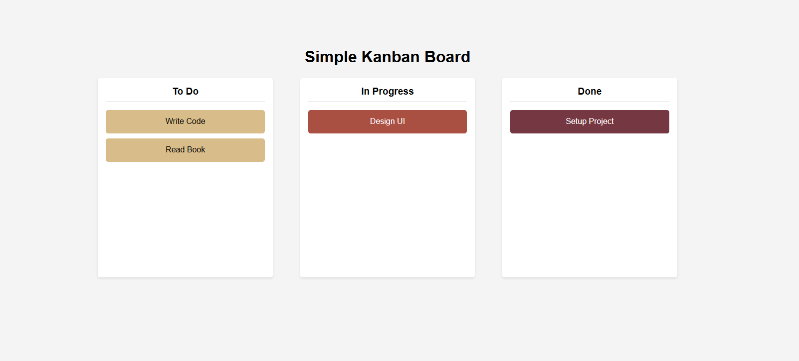

# Simple Drag & Drop Kanban Board

This is a simple Kanban board web application built with HTML, CSS, and JavaScript. It provides a basic drag and drop interface for organizing tasks into three columns: To Do, In Progress, and Done.

## Features

- Three columns representing task states: To Do, In Progress, Done.
- Draggable task cards that can be moved between columns.
- Responsive layout adjusts for smaller screen sizes.
- Simple, clean UI using CSS flexbox.

## Usage

1. Open `index.html` in any modern web browser.
2. Drag and drop task cards between the columns to update their status.
3. The layout is responsive and will adjust for smaller screen widths.

## File Structure

- `index.html`: Main HTML structure of the Kanban board.
- `style.css`: Stylesheet for layout and design.
- `script.js`: JavaScript enabling drag and drop functionality.

## Technologies Used

- HTML5
- CSS3
- JavaScript (ES6)


### Images

```markdown

```

## Potential Improvements

- Persist task states using localStorage or a backend.
- Add functionality to add, edit, or delete tasks dynamically.
- Improve accessibility features.
- Enhance styling and animations.

---
Enjoy organizing your tasks with this simple Kanban board!
